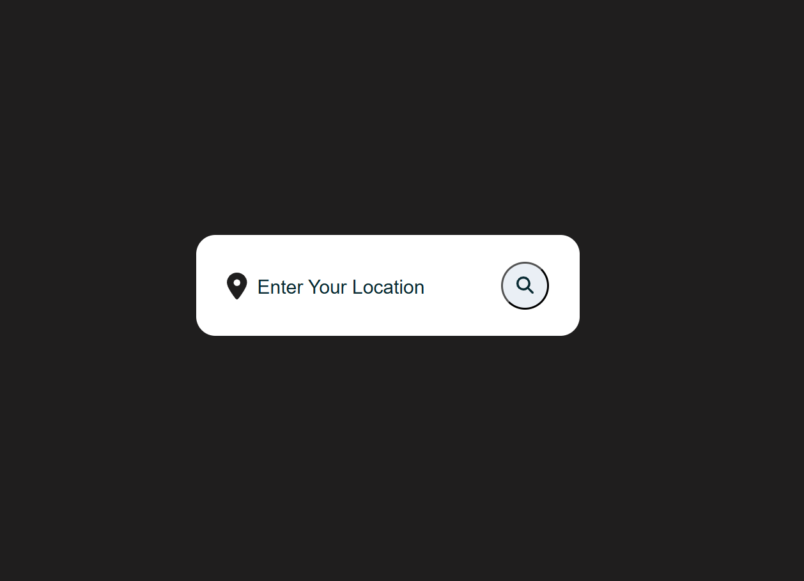
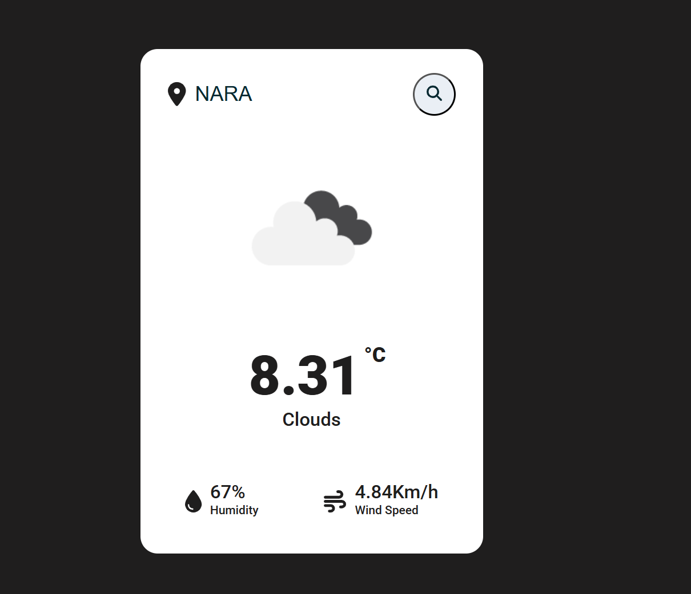
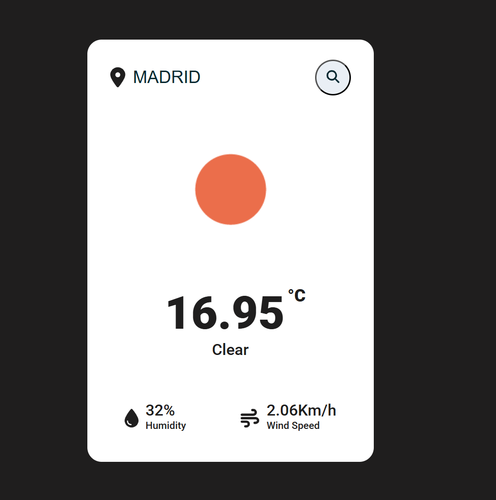
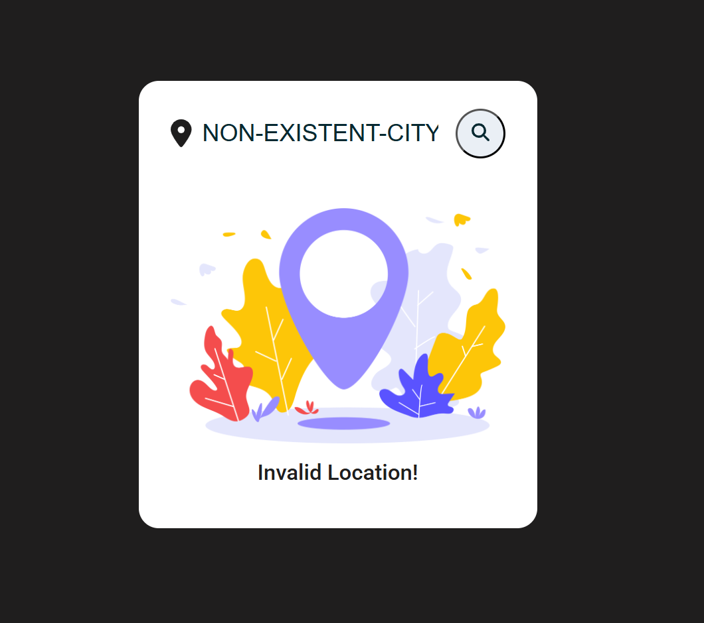

# 🌤️ Weather App

The **Weather App** is a simple and intuitive React application that fetches real-time weather data using the **OpenWeather API**. Users can enter a city or location name to retrieve current weather conditions, including temperature, humidity, wind speed, and a descriptive weather status.

## 🌍 Live Demo

You can access the Weather App here: **[Weather App Website](https://weather-app-ramune.netlify.app/)**


## ✨ Features

- ✅ Search for any city or location worldwide
- ✅ Display current temperature 🌡️
- ✅ Show weather conditions (e.g., Clear, Clouds, Rain) ☁️
- ✅ Display humidity percentage 💧
- ✅ Show wind speed 🌬️
- ✅ User-friendly and responsive design 📱

## 📸 Screenshots

### 🌍 Home Screen
||
|:---:|

### 🔍 Search Result
|  | |  |
|:---:|:---:|:---:|


## 🛠️ Technologies Used

- **React** (Frontend Framework)
- **TypeScript** (Static Typing)
- **Axios** (API Requests)
- **OpenWeather API** (Weather Data)
- **FontAwesome** (Icons)
- **Vite** (Build Tool)

## 🚀 Installation & Setup

Follow these steps to get the project running on your local machine:

### 1️⃣ Clone the Repository

```sh
git clone https://github.com/your-repo/weather-app.git
cd weather-app
```

### 2️⃣ Install Dependencies

```sh
npm install
```

### 3️⃣ Set Up Environment Variables

Create a `.env` file in the root directory and add your **OpenWeather API key**:

```sh
VITE_API_KEY=your_openweather_api_key
```

### 4️⃣ Start the Development Server

```sh
npm run dev
```

## 📝 Usage Guide

1. Enter the name of a **city or location** in the search box.
2. Click the **search button** to fetch weather data.
3. If the city is found, the app will display:
   - 🌡️ **Temperature**
   - ☁️ **Weather status** (e.g., Clear, Clouds, Rain)
   - 💧 **Humidity percentage**
   - 🌬️ **Wind speed**
4. If the city is **not found**, an error message will be displayed. ❌

## 📜 License

This project is open-source and available under the **MIT License**.

---


